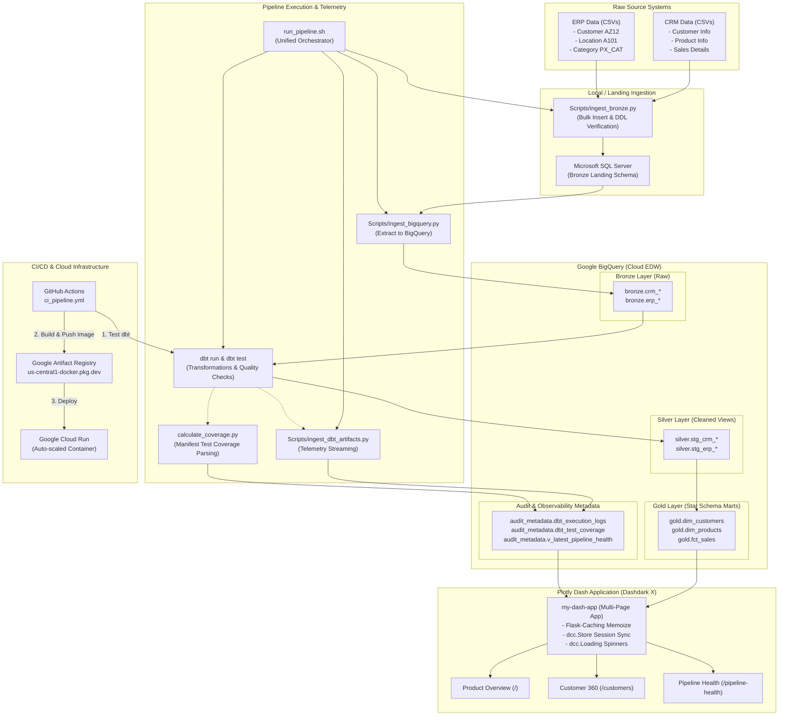
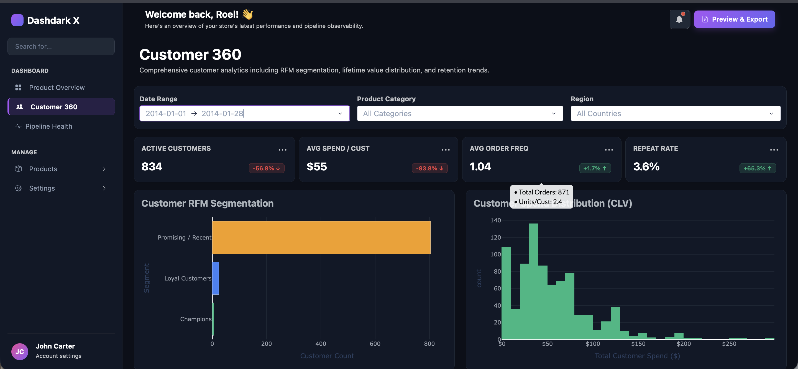
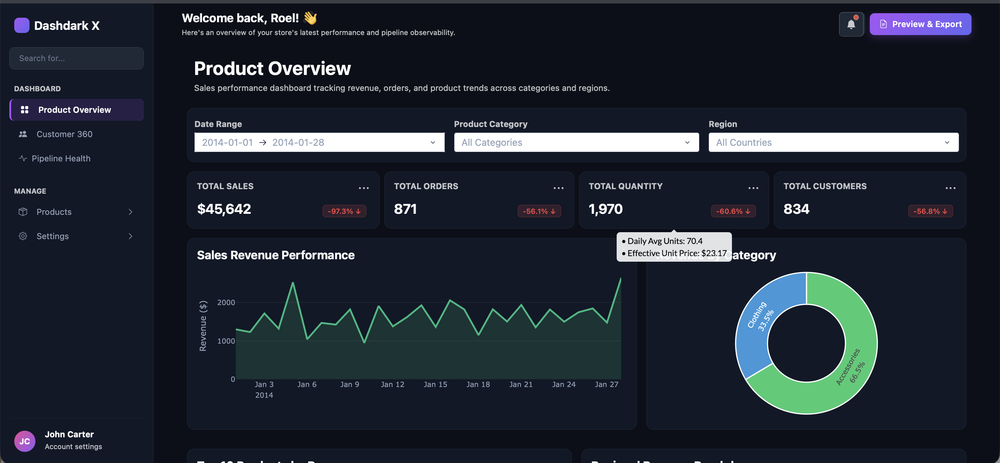
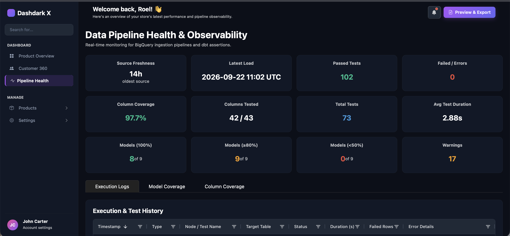
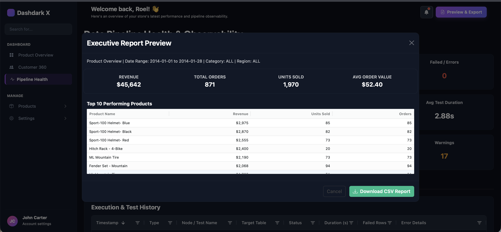

# 🚀 Enterprise Data Warehouse, Pipeline Observability & Analytics Platform

[](https://dash-observability-app-1022429033383.us-central1.run.app/)

> 🌐 **Live Interactive App:** [https://dash-observability-app-1022429033383.us-central1.run.app/](https://dash-observability-app-1022429033383.us-central1.run.app/)

[](https://www.python.org/)
[](https://www.getdbt.com/)
[](https://cloud.google.com/bigquery)
[](https://dash.plotly.com/)
[](https://www.docker.com/)
[](https://cloud.google.com/run)
[](https://github.com/features/actions)
[](https://github.com/astral-sh/uv)


An end-to-end, production-grade enterprise data engineering and business intelligence platform. The system ingests raw multi-source enterprise data (CRM & ERP), transforms it through a Medallion Architecture (Bronze &rarr; Silver &rarr; Gold) in **Google BigQuery** using **dbt**, captures and logs data quality test telemetry, and visualizes live metrics via an interactive, containerized **Plotly Dash** application deployed serverless on **Google Cloud Run**.

---

## 📌 Table of Contents

- [Executive Summary](#-executive-summary)
- [System Architecture](#-system-architecture)
- [Major Implementations](#-major-implementations)
  - [1. Multi-Source Ingestion & ETL Automation](#1-multi-source-ingestion--etl-automation)
  - [2. Medallion Data Modeling & Quality Assertion Layer (dbt)](#2-medallion-data-modeling--quality-assertion-layer-dbt)
  - [3. Pipeline Observability, Test Coverage & Telemetry Logging](#3-pipeline-observability-test-coverage--telemetry-logging)
  - [4. Interactive Multi-Page Dash Application ("Dashdark X")](#4-interactive-multi-page-dash-application-dashdark-x)
  - [5. CI/CD Pipeline & Google Cloud Run Deployment](#5-cicd-pipeline--google-cloud-run-deployment)
- [Screenshots & Dashboards](#-screenshots--dashboards)
- [Technology Stack](#-technology-stack)
- [Project Directory Structure](#-project-directory-structure)
- [Getting Started & Local Setup](#-getting-started--local-setup)
  - [Prerequisites](#prerequisites)
  - [Environment Configuration](#environment-configuration)
  - [Running the Ingestion & dbt Pipeline](#running-the-ingestion--dbt-pipeline)
  - [Running the Dash Web App Locally](#running-the-dash-web-app-locally)
  - [Running with Docker](#running-with-docker)
- [Data Models & Schema Reference](#-data-models--schema-reference)
- [Performance & Best Practices](#-performance--best-practices)

---

## 📖 Executive Summary

Modern enterprise analytics demands not only timely reporting, but also transparent data governance and pipeline observability. This repository addresses the entire lifecycle:

1. **Ingests** disparate ERP (customer demographics, geographic locations, product categorization) and CRM (customer profiles, product catalogs, line-item sales orders) datasets.
2. **Transforms** raw records into structured star-schema dimensional models (`dim_customers`, `dim_products`, `fct_sales`) using **dbt Core** and custom macros on **Google BigQuery**.
3. **Validates** every stage with automated assertions (uniqueness, referential integrity, range constraints, whitespace validation).
4. **Captures Telemetry** from dbt artifacts (`manifest.json` and `run_results.json`) to track run durations, failures, warnings, and column-level test coverage over time.
5. **Presents Business & Data Health Insights** through an interactive, multi-page **Plotly Dash** interface equipped with server-side caching (`Flask-Caching`), client-side session store (`dcc.Store`), asynchronous loading spinners, modal drill-downs, and executive CSV export capabilities.
6. **Continuous Delivery** automatically compiles and tests dbt models on pull requests, builds an optimized Docker container, and deploys to **Google Cloud Run** on pushes to `main`.

---

## 🏗️ System Architecture



---

## ⚡ Major Implementations

### 1. Multi-Source Ingestion & ETL Automation

- **SQL Server Landing Ingestion (`Scripts/ingest_bronze.py`)**:
  - Dynamically verifies table existence via pre-defined DDL scripts (`ddl_create_bronze_*.sql`).
  - Implements fast bulk extraction from raw CSV sources using SQLAlchemy and `pyodbc`, clearing and loading target bronze tables with execution timing and row-count audits.
- **BigQuery Extraction & Ingestion (`Scripts/ingest_bigquery.py`)**:
  - Reads staged records from SQL Server, handles schema conversion and null sanitization, and streams them into BigQuery native `bronze` tables using `google-cloud-bigquery`.
  - Emits real-time execution status into the audit metadata log table upon job completion.
- **Unified Orchestration Pipeline (`run_pipeline.sh`)**:
  - Executes the complete data engineering lifecycle in a single command:
    1. CSV &rarr; SQL Server Bronze
    2. SQL Server &rarr; BigQuery Bronze
    3. `dbt run` & `dbt test`
    4. dbt artifact parsing and BigQuery audit streaming.

### 2. Medallion Data Modeling & Quality Assertion Layer (dbt)

- **Medallion Architecture Structure**:
  - **Silver Layer (`analytics_layer/models/staging/`)**: Cleaned and typed views. Handles string normalization, surrogate key derivations, case statements, date standardizations, and whitespace trimming.
    - `stg_crm_cust_info`, `stg_crm_prd_info`, `stg_crm_sales_details`
    - `stg_erp_cust_az12`, `stg_erp_loc_a101`, `stg_erp_px_cat_g1v2`
  - **Gold Layer (`analytics_layer/models/marts/`)**: Materialized star-schema tables optimized for analytical queries:
    - `dim_customers`: Unified customer master combining CRM identity and ERP geographic location data.
    - `dim_products`: Active product dimensions with catalog hierarchy, line segments, and unit cost.
    - `fct_sales`: Granular transaction fact table joining customer and product surrogate keys with sales metrics.
    - `product_360`: Analytical rollups for multi-dimensional merchandising analysis.
- **Comprehensive Data Quality Suite**:
  - **Custom Generic Macros**:
    - `test_is_clean_trimmed.sql`: Asserts that string columns have no leading/trailing whitespace or improper padding.
    - `test_is_date_before.sql` & `test_is_date_before_columns.sql`: Enforces temporal business logic (e.g. order date $\le$ ship date).
  - **Contract & Boundary Testing**: Out-of-the-box and `dbt_utils` tests ensuring surrogate key uniqueness, non-nullability, foreign key referential integrity (`relationships`), and non-negative financial values (`>= 0`).
  - **SQL Linting & Standards**: Configured with `.sqlfluff` utilizing the dbt templater to enforce clean SQL formatting and naming conventions across all models.

### 3. Pipeline Observability, Test Coverage & Telemetry Logging

- **dbt Artifact Telemetry Parser (`Scripts/ingest_dbt_artifacts.py` & `calculate_coverage.py`)**:
  - Ingests `target/manifest.json` and `target/run_results.json` after execution runs.
  - Automatically calculates column-level test coverage across all models (tested columns vs. total columns, test count per column, test types applied).
  - Flattens complex dbt graph nodes into structured rows and streams them directly into Google BigQuery.
- **Audit Logging Utility (`utils/audit_logger.py`)**:
  - Centralized logger streaming ingestion records, durations, target tables, and error messages into BigQuery table `audit_metadata.dbt_execution_logs`.
- **Automated Health Evaluation View (`v_latest_pipeline_health.sql`)**:
  - SQL view that calculates real-time operational metrics from the most recent run:
    - Overall system status: `HEALTHY`, `WARNING`, or `CRITICAL`.
    - Passed, failed, and warning test counts.
    - Column test coverage percentage across the warehouse.
    - Identification of models with 100%, $\ge$80%, and $<$50% coverage.
    - Source table freshness (hours/minutes elapsed since last bronze ingestion).

### 4. Interactive Multi-Page Dash Application ("Dashdark X")

Built using Plotly Dash's native `dash.register_page` architecture, styled with a modern dark theme (`dbc.themes.DARKLY`), Bootstrap Icons, and bespoke CSS modules (`assets/`).

#### 🎛️ Page 1: Product Overview (`/`)
- **Interactive Global Filters**: Sticky filter bar supporting dynamic Date Range Picker, Product Category dropdown, and Country/Region selector.
- **Period-over-Period (PoP) KPI Bar**:
  - Displays Total Sales, Total Orders, Total Quantity, and Total Customers.
  - Dynamically calculates prior-period comparisons with color-coded trend badges (`+X.X% ↑` / `-X.X% ↓`) and hover tooltips explaining the comparison period.
- **Interactive Visualizations**:
  - **Sales Revenue Performance**: Time-series trend line with hover data.
  - **Revenue by Category**: Donut chart detailing category revenue contribution.
  - **Top 10 Products by Revenue**: Horizontal bar chart sorted by revenue.
  - **Regional Revenue Breakdown**: Country-level sales distribution.
- **Product Drill-Down Modal**:
  - Clicking any product bar in the Top 10 chart launches a modal showing product-specific KPIs (Lifetime Revenue, Units Sold, Avg Price) and an embedded **Dash AG Grid** table of recent transactions.

#### 👥 Page 2: Customer 360 (`/customers`)
- **Synchronized Session State**: Synchronized with the global filter bar via `dcc.Store(id="global-filter-store", storage_type="session")`.
- **Customer Health Metrics**: Active Customers, Average Spend per Customer, Average Order Frequency, and Repeat Purchase Rate with percentage badges.
- **Advanced Behavioral Analytics**:
  - **Customer RFM Segmentation**: Classifies customer cohorts into *Champions*, *Loyal Customers*, *Promising / Recent*, and *Hibernating / Lost*.
  - **Customer Spend Distribution (CLV)**: Histogram displaying customer lifetime value buckets.
  - **Active Customer Trend**: Monthly active customer acquisition and retention trajectory.
- **High-Value Champions Table & Drill-Down**:
  - Interactive **Dash AG Grid** ranking top customers by monetary spend.
  - Clicking any customer opens a Customer Profile Modal displaying lifetime metrics, favorite category, and detailed order history.

#### 🩺 Page 3: Pipeline Health & Observability (`/pipeline-health`)
- **System Health Monitor**: Live operational dashboard fed directly from BigQuery `audit_metadata` tables.
- **3-Tier KPI Bar (12 Health Indicators)**:
  - *Row 1 - Ingestion & Freshness*: Source Freshness (hours elapsed), Latest Load timestamp, Passed Tests, Failed/Error count.
  - *Row 2 - Test Coverage*: Overall Column Coverage %, Columns Tested ratio, Total Tests defined, Average Test Duration.
  - *Row 3 - Model Governance*: Models with 100% coverage, Models with $\ge$80% coverage, Models with $<$50% coverage, Warning assertions.
- **Interactive Tabbed Deep Dives**:
  - **Tab 1: Execution & Test History**: Dash AG Grid displaying granular execution logs with colored status pills (`pass` green, `fail` red, `warn` yellow), execution times, and error detail tooltips.
  - **Tab 2: Model Coverage**: Per-model coverage breakdown with animated percentage indicators.
  - **Tab 3: Column-Level Coverage**: Drill-down grid highlighting untested columns in red, listing data types and applied test names.

#### 🔔 Notification Center, Alerts & Executive Export
- **Dynamic Header Notification Bell**: Automatically queries audit health, displays unread alert badges when tests fail or tables are stale, and provides an interactive dropdown with direct navigation links to unresolved pipeline issues.
- **Real-Time Alert Toasts**: Pops up non-blocking Bootstrap toasts when critical pipeline failures or assertion warnings are detected.
- **Executive CSV Export**:
  - A global "Export Report" button opens an interactive preview modal showing calculated summary KPIs and top records.
  - Generates executive CSV reports (`product_overview_summary_*.csv` or `customer_360_summary_*.csv`) ready for stakeholder distribution.
- **Asynchronous Feedback**: Every visual, card, and modal is wrapped in standardized `dcc.Loading` spinners (emerald green `#10b981`).

### 5. CI/CD Pipeline & Google Cloud Run Deployment

- **Automated CI/CD Workflow (`.github/workflows/ci_pipeline.yml`)**:
  - **Validate & Test Job**: Triggers on pull requests and pushes to `main`. Automatically provisions Python 3.12 with Astral `uv`, injects GCP credentials, and executes `dbt compile` and `dbt test` to prevent regressions.
  - **Deploy Cloud Run Job**: On merge to `main`, configures Docker authentication to Google Artifact Registry, builds an optimized production container, and deploys to **Google Cloud Run** (`dash-observability-app`) in `us-central1` with CPU/memory limits and automatic scaling (0 to 2 instances).
- **Production Containerization (`Dockerfile`)**:
  - Lightweight Python 3.12-slim base image.
  - Uses `uv` for deterministic dependency resolution.
  - Executes via **Gunicorn** WSGI production server (`--workers 1 --threads 8 app:server`).

---

## 🖼️ Screenshots & Dashboards

### Product Overview Dashboard
<!-- Screenshot Placeholder: Product Overview Dashboard -->
```text
+----------------------------------------------------------------------------------------------------+
| [Brand Logo] Dashdark X   | Date Range: [ 2013-01-01 to 2014-06-30 ] [ Category: ALL ] [ Region: ALL ]   |
+----------------------------------------------------------------------------------------------------+
|  TOTAL SALES ($1.42M)   |   TOTAL ORDERS (3,842)    |   TOTAL UNITS (12,410)  |  CUSTOMERS (1,890) |
+----------------------------------------------------------------------------------------------------+
|  Sales Revenue Performance (Line Trend)               |  Revenue by Category (Donut Chart)         |
|  [ ~~~~~~~~~~~~~~~~~~~~~~~~~~~~~~~~~~~~~~~~~~~~~~~~ ] |  [ (Bikes 70% | Acc 20% | Clo 10%) ]       |
+----------------------------------------------------------------------------------------------------+
|  Top 10 Products by Revenue (Bar Chart - Clickable)   |  Regional Revenue Breakdown (Bar Chart)    |
|  [ ============================== ]                   |  [ =================================== ]   |
+----------------------------------------------------------------------------------------------------+
```



---

### Customer 360 & RFM Segmentation
<!-- Screenshot Placeholder: Customer 360 Dashboard -->
```text
+----------------------------------------------------------------------------------------------------+
| ACTIVE CUSTOMERS (1,890) | AVG SPEND / CUST ($752)  | AVG ORDER FREQ (2.03)  | REPEAT RATE (34.2%) |
+----------------------------------------------------------------------------------------------------+
|  Customer RFM Segmentation (Scatter / Bar)            |  Customer Lifetime Value Spend Dist (CLV)  |
|  [ Champions | Loyal | Promising | Hibernating ]      |  [ Histogram: $0-$200, $200-$500, $1K+ ]   |
+----------------------------------------------------------------------------------------------------+
|  Top High-Value Champions (AG Grid Table with Modal)  |  Active Customer Growth Trend              |
|  [ Jordan Turner | $14,200 | 8 Orders | United States ] |  [ --------------------------------- ]   |
+----------------------------------------------------------------------------------------------------+
```



---

### Pipeline Health & Observability
<!-- Screenshot Placeholder: Pipeline Health & Observability Dashboard -->
```text
+----------------------------------------------------------------------------------------------------+
| SYSTEM STATUS: HEALTHY [ 98.4% Tests Passed ]                                                      |
+----------------------------------------------------------------------------------------------------+
| SOURCE FRESHNESS: 2h    | LATEST LOAD: 2026-09-19 | PASSED TESTS: 64       | FAILED TESTS: 0       |
| COLUMN COVERAGE: 91.2%  | COLUMNS TESTED: 78/85   | TOTAL TESTS: 112       | AVG DURATION: 0.42s   |
| MODELS (100%): 6        | MODELS (>=80%): 2       | MODELS (<50%): 0       | WARNINGS: 0           |
+----------------------------------------------------------------------------------------------------+
| [ Tab: Execution Logs ] [ Tab: Model Coverage ] [ Tab: Column Coverage ]                          |
| AG Grid View: Status Pills, Durations, Failure Tracebacks, Model Granularity                       |
+----------------------------------------------------------------------------------------------------+
```



---

### Executive Report Preview & Export Modal
<!-- Screenshot Placeholder: Executive Report Export Modal -->
```text
+----------------------------------------------------------------------------------------------------+
|  EXPORT EXECUTIVE SUMMARY REPORT                                                               [X] |
|  Date Range: 2013-01-01 to 2014-06-30 | Product Category: ALL | Region: ALL                        |
+----------------------------------------------------------------------------------------------------+
|  Active Customers: 1,890 | Avg Spend: $752 | Avg Order Frequency: 2.03 | Repeat Rate: 34.2%        |
|  [ AG Grid Preview: Top 10 High-Value Champions / Top Products ]                                   |
+----------------------------------------------------------------------------------------------------+
|                                                          [ Close ]   [ Download Formatted CSV ]    |
+----------------------------------------------------------------------------------------------------+
```



---

## 🛠️ Technology Stack

| Domain | Technology / Library | Purpose |
| :--- | :--- | :--- |
| **Cloud EDW & Storage** | **Google BigQuery** | Cloud data warehousing, bronze-silver-gold datasets, audit logs |
| **On-Premise / Staging**| **Microsoft SQL Server** | Initial bronze landing schema, relational table staging |
| **Cloud Computing** | **Google Cloud Run** | Serverless container execution with auto-scaling (0–2 instances) |
| **Containerization** | **Docker** & **Gunicorn** | Container image packaging and production WSGI HTTP server |
| **Data Transformation** | **dbt Core (1.12+)** & **dbt-bigquery** | Medallion ELT, star-schema data modeling, incremental execution |
| **Data Quality & Linting**| **dbt-utils**, **dbt-expectations**, **SQLFluff** | Data assertion testing, referential integrity, SQL styling |
| **Telemetry & Observability** | **Custom dbt Artifact Parsers** | Ingesting `manifest.json` and `run_results.json` into BigQuery audit logs |
| **Dashboard Framework** | **Plotly Dash (4.4+)** | Interactive multi-page web application (`dash.register_page`) |
| **UI Components & Themes**| **Dash Bootstrap Components (DBC)** | Darkly theme layout, responsive grids, navbars, modals, tooltips |
| **High-Performance Grids**| **Dash AG Grid (35.3+)** | Enterprise tables with sorting, filtering, and cell styling conditions |
| **Caching Engine** | **Flask-Caching** | Server-side memoization (`@cache.memoize`) for BigQuery queries |
| **Data Manipulation** | **Pandas (3.0+)**, **PyArrow**, **SQLAlchemy** | High-speed data manipulation, serialization, and database connections |
| **Package Management** | **uv (Astral)** | Extremely fast Python dependency resolution and virtual environments |
| **Continuous Delivery** | **GitHub Actions** | Automated CI testing on pull requests & Cloud Run CD deployment |

---

## 📂 Project Directory Structure

```text
demo-database/
├── .github/
│   └── workflows/
│       └── ci_pipeline.yml          # GitHub Actions CI/CD: dbt validation & Cloud Run deploy
├── .agents/skills/
│   └── loading-spinner/            # Task capsule: standardized dcc.Loading spinner pattern
├── analytics_layer/                 # dbt transformation project
│   ├── analyses/
│   │   └── v_latest_pipeline_health.sql # SQL view aggregating overall pipeline health
│   ├── macros/
│   │   ├── test_is_clean_trimmed.sql    # Custom macro: whitespace padding validation
│   │   └── test_is_date_before.sql      # Custom macro: chronological date validation
│   ├── models/
│   │   ├── _sources/
│   │   │   └── _sources.yml         # Bronze source definitions & freshness checks
│   │   ├── staging/                 # Silver layer: cleaned, typed views
│   │   │   ├── _staging__models.yml # Column-level tests & descriptions
│   │   │   ├── stg_crm_*.sql        # CRM staging models (customers, products, sales)
│   │   │   └── stg_erp_*.sql        # ERP staging models (customers, locations, categories)
│   │   └── marts/                   # Gold layer: business-ready star schema
│   │       ├── _marts_models.yml    # Mart tests & foreign key relationships
│   │       ├── dim_customers.sql    # Unified customer dimension
│   │       ├── dim_products.sql     # Product catalog dimension
│   │       ├── fct_sales.sql        # Sales transaction fact table
│   │       └── product_360.sql      # Product analytical rollup
│   ├── scripts/
│   │   ├── calculate_coverage.py    # Parses manifest.json to calculate test coverage
│   │   └── load_coverage_to_bq.py   # Streams test coverage metrics to BigQuery
│   └── dbt_project.yml              # dbt project configurations & schema routing
├── my-dash-app/                     # Plotly Dash web application
│   ├── assets/                      # Custom dark-theme CSS stylesheets
│   │   ├── 01-base.css              # Global resets, typography, and scrollbars
│   │   ├── 02-sidebar.css           # Sidebar styles and active pill indicators
│   │   ├── 03-header.css            # Header, greeting, notification menu, toast styles
│   │   ├── 04-filters.css           # Sticky filter bar, dropdowns, and date picker
│   │   ├── 05-kpi-cards.css         # Dark KPI cards, number formatting, trend badges
│   │   └── 06-components.css        # Modal dialogs and AG Grid overrides
│   ├── components/                  # Reusable UI component modules
│   │   ├── filter_bar.py            # Dynamic DatePickerRange and category/country filters
│   │   ├── header.py                # Top navigation header, alerts bell, toast, export btn
│   │   ├── kpi_bar.py               # Responsive KPI cards with badges and tooltips
│   │   └── sidebar.py               # Collapsible sidebar with page navigation & avatar
│   ├── pages/                       # Multi-page views (dash.register_page)
│   │   ├── overview.py              # Product Overview page (KPIs, charts, drill-down modal)
│   │   ├── customer_360.py          # Customer 360 page (RFM, CLV, top champions table)
│   │   └── pipeline_health.py       # Pipeline Health & Observability page
│   ├── utils/                       # Shared dashboard utilities
│   │   ├── cache.py                 # Flask-Caching instance definition
│   │   └── helpers.py               # DataFrame filtering, PoP badge math, compact numbers
│   ├── app.py                       # Main application entry point & export callbacks
│   ├── app_observability.py         # Standalone pipeline observability & lineage viewer
│   └── data_loader.py               # BigQuery data fetchers with @cache.memoize
├── Scripts/                         # Data ingestion and DDL scripts
│   ├── create_init_database.sql     # SQL Server database initialization
│   ├── ddl_create_bronze_*.sql      # DDL definitions for bronze tables
│   ├── ingest_bronze.py             # CSV to SQL Server bronze ingestion
│   ├── ingest_bigquery.py           # SQL Server to BigQuery extraction & load
│   └── ingest_dbt_artifacts.py      # Streams dbt run results into BigQuery audit logs
├── utils/
│   ├── audit_logger.py              # Centralized BigQuery audit logging helper
│   └── helpers.py                   # Filtering and statistical helper functions
├── Dockerfile                       # Production multi-stage Docker build file
├── pyproject.toml                   # Pinned project dependencies managed with uv
├── run_pipeline.sh                  # End-to-end execution bash script
└── README.md                        # Project documentation (this file)
```

---

## 🚀 Getting Started & Local Setup

### Prerequisites

- **Python**: Version `3.12+`
- **Package Manager**: [`uv`](https://github.com/astral-sh/uv) recommended (`curl -LsSf https://astral.sh/uv/install.sh | sh`)
- **Google Cloud Platform**:
  - BigQuery API enabled on project `quantum-echo-data-eng-prod` (or your custom project).
  - Service Account Key JSON file with BigQuery Data Editor and Job User permissions.
- **Microsoft SQL Server**: Local instance or Docker container (`mcr.microsoft.com/mssql/server`).

---

### Environment Configuration

Create a `.env` file in the project root by copying the template below:

```bash
# Microsoft SQL Server Staging Database
DB_SERVER=localhost
DB_DATABASE=Demo_Database
DB_USERNAME=sa
DB_PASSWORD=YourStrongPassword123!
DB_DRIVER=ODBC Driver 18 for SQL Server

# Raw CSV Data Source Directory
SOURCE_FOLDER=/path/to/your/raw/csv/files

# Google Cloud Platform Credentials
GCP_PROJECT_ID=quantum-echo-data-eng-prod
GCP_KEY_PATH=/path/to/your/gcp-key.json
TARGET_DATASET=bronze
```

Ensure your `~/.dbt/profiles.yml` is configured for BigQuery:

```yaml
analytics_layer:
  target: dev
  outputs:
    dev:
      type: bigquery
      method: service-account
      project: "quantum-echo-data-eng-prod" # Replace with your project ID
      dataset: silver
      keyfile: "/path/to/your/gcp-key.json"
      location: us-central1
      threads: 4
      job_execution_timeout_seconds: 300
      priority: interactive
```

---

### Running the Ingestion & dbt Pipeline

Install dependencies using `uv`:

```bash
uv sync
```

To run the full end-to-end ingestion, transformation, and audit telemetry pipeline:

```bash
chmod +x run_pipeline.sh
./run_pipeline.sh
```

Or execute stages individually:

```bash
# Step 1: Ingest raw CSVs into SQL Server Bronze schema
uv run Scripts/ingest_bronze.py /path/to/source/csvs

# Step 2: Extract from SQL Server to BigQuery Bronze
uv run Scripts/ingest_bigquery.py

# Step 3: Run dbt models and quality assertions
cd analytics_layer
dbt run
dbt test
cd ..

# Step 4: Stream dbt telemetry into BigQuery audit tables
uv run Scripts/ingest_dbt_artifacts.py
uv run analytics_layer/scripts/calculate_coverage.py
```

---

### Running the Dash Web App Locally

Launch the Plotly Dash application with hot-reloading:

```bash
cd my-dash-app
uv run python app.py
```

Open your browser and navigate to:
```text
http://127.0.0.1:8050/
```

- **Product Overview**: `http://127.0.0.1:8050/`
- **Customer 360**: `http://127.0.0.1:8050/customers`
- **Pipeline Health**: `http://127.0.0.1:8050/pipeline-health`

---

### Running with Docker

Build and run the container locally:

```bash
# Build the Docker image
docker build -t dash-observability-app .

# Run the container
docker run -p 8080:8080 \
  -e GCP_PROJECT_ID="quantum-echo-data-eng-prod" \
  -e GCP_KEY_PATH="/app/gcp-key.json" \
  -v $(pwd)/gcp-key.json:/app/gcp-key.json:ro \
  dash-observability-app
```

Navigate to `http://localhost:8080` to access the application.

---

## 📊 Data Models & Schema Reference

### 🥉 Bronze Layer (Landing - BigQuery Dataset: `bronze`)
- `crm_cust_info`: Raw customer profile extraction.
- `crm_prd_info`: Raw product catalog with effective date intervals.
- `crm_sales_details`: Raw transaction line items with order dates and quantities.
- `erp_cust_az12`: Raw ERP customer demographic records.
- `erp_loc_a101`: Raw geographic country mappings.
- `erp_px_cat_g1v2`: Raw product categorization codes.

### 🥈 Silver Layer (Staging - BigQuery Dataset: `silver`)
- `stg_crm_cust_info`: Deduplicated customer master with standard string trimming and gender harmonization.
- `stg_crm_prd_info`: Type-casted product catalog with derived category business keys.
- `stg_crm_sales_details`: Cleaned sales transactions with sanitized pricing and quantities.
- `stg_erp_cust_az12`: Cleaned customer demographics with ISO birthdates.
- `stg_erp_loc_a101`: Standardized country/region dimension mapping.
- `stg_erp_px_cat_g1v2`: Normalized category descriptions and maintenance codes.

### 🥇 Gold Layer (Marts - BigQuery Dataset: `gold`)
- `dim_customers`: Unified customer dimension joined across CRM and ERP on customer ID.
- `dim_products`: Dimensional product catalog joined with category descriptions.
- `fct_sales`: Granular transaction fact table linking `customer_key` and `product_key` to monetary metrics (`gross_sales_amount`, `quantity`, `unit_price`).
- `product_360`: Analytical rollup of product performance across channels and demographics.

### 🔍 Audit & Observability (BigQuery Dataset: `audit_metadata`)
- `dbt_execution_logs`: Historical append-only log of every pipeline execution, node name, duration, affected rows, status (`pass`/`fail`), and error tracebacks.
- `dbt_test_coverage`: Snapshot of column-level test assertions extracted from `manifest.json`.
- `v_latest_pipeline_health`: Aggregated monitoring view reporting current operational status, overall coverage %, and pass/failure totals.

---

## ⚡ Performance & Best Practices

1. **Server-Side Memoization (`Flask-Caching`)**:
   - All BigQuery data loaders in `my-dash-app/data_loader.py` are decorated with `@cache.memoize()`.
   - Subsequent page navigations or filter updates fetch pre-aggregated data from the cache without incurring redundant BigQuery scan costs.
2. **Optimized BigQuery Scanning**:
   - SQL queries in `data_loader.py` select only required projection columns rather than `SELECT *`.
   - Date range boundaries filter transactions before passing DataFrames to visualization routines.
3. **Thread Safety & Session Stores**:
   - Mutable user state (active date windows, selected categories, selected regions) resides strictly in the browser using `dcc.Store(storage_type="session")`. No global state variables are modified during request handling.
4. **Resilient Callbacks**:
   - Dash callbacks use `prevent_initial_call=True` and return `dash.no_update` whenever outputs should remain unchanged.
   - `suppress_callback_exceptions=True` is enabled to support multi-page dynamic DOM rendering.

---

## 📄 License & Attribution

Developed by **QuantumEcho** ([datanerdbytes@gmail.com](mailto:datanerdbytes@gmail.com)).  
Internal enterprise analytics & pipeline observability platform. All rights reserved.
